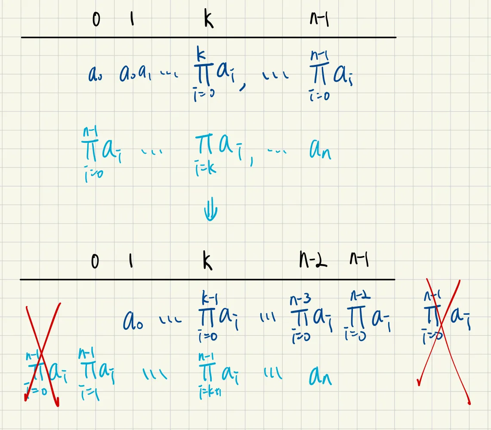

# 238. Product of Array Except Self

## Solution

So the problem asks us to return a array, with each value of the returned array being the product of the array (all) expect the element itself.

For example, for a array $\text{\{} 1,2,3,4\text{\}}$, the first element should be $\frac{1\times2\times3\times4}{1}$, second should be $\frac{1\times2\times3\times4}{2}$….and so on and so forth. The tricky part is that dividing operator is forbidden.

Hmm, seems like a tough problem, but once you notice one simple fact you will be enlightened.

Notice that the phrase the product of all except myself simply means:


for every element we treat it as a knife that slices the array into two halves. If we are able to obtain the product of the left segment and the right segment, we can multyply them together and then return as the demanded result.

Ok, but how do we obtain such value?

If we precalculated the prefix product of the array, for the k-th element, we have:

$$
\prod_{i=0}^{k}{a_i}
$$

and if we pre-calculated the suffix product array, for the k-th element, we have:

$$
\prod_{i=k}^{n-1}{a_i}
$$

Notice that If we want to calculate the value of the desired kth value, we want:

$$
\prod_{i=0}^{k-1}{a_i} \text{ \& } \prod_{i=k+1}^{n-1}{a_i}
$$

This means we can shift both the precalculated prefix and suffix by one to make them multipliable.

Here’s the demonstration:



and that $\prod_{i=0}^{n-1}{a_i}$ is useless, we remove them from the terminals. Well, not actually ignore that, we are just gonna ignore them when doing our calculations.

The implementation is as below, the time complexity is $O(N)$, and the space complexity is also $O(N)$.

## Code

```cpp
class Solution {
   public:
    vector<int> productExceptSelf(vector<int>& nums) {
        int n = nums.size();
        vector<int> prefix(n, 1);
        vector<int> suffix(n, 1);
        for (int i = 1; i < n; i++) {
            prefix[i] = prefix[i - 1] * nums[i - 1];
        }
        for (int i = n - 2; i >= 0; i--) {
            suffix[i] = suffix[i + 1] * nums[i + 1];
        }
        vector<int> ans(n, 0);
        for (int i = 0; i < n; i++) {
            ans[i] = prefix[i] * suffix[i];
        }
        return ans;
    }
};
```
