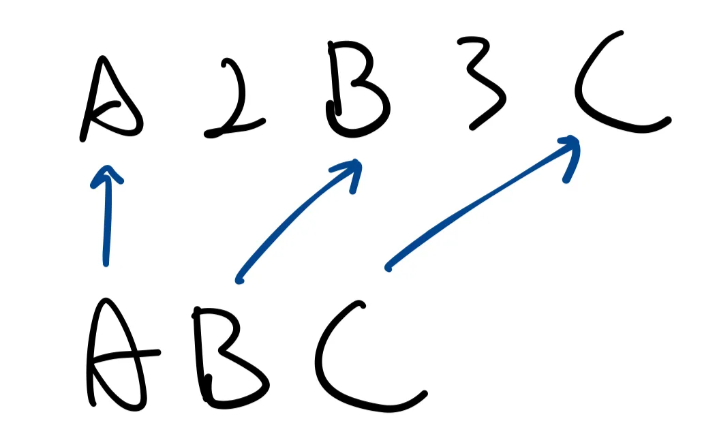

# 2825. Make String a Subsequence Using Cyclic Increments

## Code

Well, that's quite a description. It feels to me that the official is trying to make this problem harder by the description.

Fortunately, we can solve this problem in no time using the skills that we’ve already obtained. This is quite simple once we understand that this problem is just asking if we can find the target characters in a given set.

### Understanding Subsequence

Picture a list of elements, you can imagine a set and then linearly place them. A subsequence is another linear set where we can remove several elements from the original sequence to obtain.

For example:



Here, ABC is a subsequence of A2B3C. Note that the concept of subsequence can be really interesting when it comes to dynamic programming problems. For now, we’ll just leave it here.

### Solving problem: Two pointer

The problem is asking if we can obtain this subsequence in the given string. Additionally, we are allowed to alter a character. By that we mean increment the char by 1. Note that z becomes an in this case. Furthermore, we can choose whether to alter or not.

We scan the string from the leftmost. Two pointers denote the leftmost index of the two strings, respectively.

- If we can match the current pointers with alteration or not, we increment both pointers by 1
- If not, we move to the next index (the main string, not the target)

Finally, if the pointer of the target string points to the end of the string, that means we have successfully found all the viable corresponding characters. We return true; otherwise, we return false.

## Solution

```c
char next(char c) { return (((c - 'a') + 1) % 26) + 'a'; }

bool canMakeSubsequence(char *str1, char *str2) {
    int n = strlen(str1);
    int m = strlen(str2);
    if (n < m) {
        return 0;
    }
    int i = 0;
    int j = 0;
    while (i < n && j < m) {
        char curr = str1[i];
        char tar = str2[j];
        if (curr == tar || next(curr) == tar) {
            i++;
            j++;
            continue;
        }
        i++;
    }
    if (j == m) {
        return 1;
    }
    return 0;
}
```
